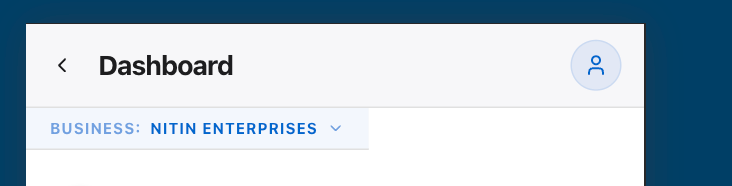

## Error Type
Console Error

## Error Message
In HTML, <button> cannot be a descendant of <button>.
This will cause a hydration error.

  ...
    <InnerLayoutRouter url="/" tree={[...]} params={{}} cacheNode={{rsc:{...}, ...}} segmentPath={[...]} ...>
      <SegmentViewNode type="layout" pagePath="(dashboard...">
        <SegmentTrieNode>
        <script>
        <script>
        <DashboardLayout>
          

            <ScrollToTop>
            <TopNav>
              

                <header>
                <BusinessSwitcher trigger={<button>}>
                  <Dialog>
                    <DialogRoot data-slot="dialog">
                      <DialogTrigger asChild={true}>
                        <DialogTrigger data-slot="dialog-tri..." asChild={true}>
>                         <button
>                           type="button"
>                           onClick={function}
>                           onMouseDown={function}
>                           onKeyDown={function}
>                           onKeyUp={function}
>                           onPointerDown={function}
>                           tabIndex={0}
>                           disabled={false}
>                           data-base-ui-click-trigger=""
>                           id="base-ui-_r_1_"
>                           aria-haspopup="dialog"
>                           aria-expanded={false}
>                           aria-controls={undefined}
>                           data-slot="dialog-trigger"
>                           asChild={true}
>                           ref={function}
>                         >
>                           <button
>                             className="flex h-7 items-center border-b bg-primary/5 px-4 text-[10px] font-bold text-p..."
>                           >
                      ...
            ...

    at button (<anonymous>:null:null)
    at TopNav (src/components/top-nav.tsx:62:13)
    at DashboardLayout (src/app/(dashboard)/layout.tsx:13:7)

## Code Frame
  60 |         <BusinessSwitcher 
  61 |           trigger={
> 62 |             <button className="flex h-7 items-center border-b bg-primary/5 px-4 text-[10px] font-bold text-primary uppercase tracking-wider backdrop-blur-sm transition-colors hover:bg-primary/10 active:bg-primary/20">
     |             ^
  63 |               Business: 
  64 |               {activeBusiness.name}
  65 |               <ChevronDown className="ml-1.5 h-3 w-3 opacity-60" />

Next.js version: 16.3.0 (Turbopack)

## Error Type
Console Error

## Error Message
<button> cannot contain a nested <button>.
See this log for the ancestor stack trace.

    at button (<anonymous>:null:null)
    at DialogTrigger (src/components/ui/dialog.tsx:15:10)
    at BusinessSwitcher (src/components/business-switcher.tsx:18:7)
    at TopNav (src/components/top-nav.tsx:60:9)
    at DashboardLayout (src/app/(dashboard)/layout.tsx:13:7)

## Code Frame
  13 |
  14 | function DialogTrigger({ ...props }: DialogPrimitive.Trigger.Props) {
> 15 |   return <DialogPrimitive.Trigger data-slot="dialog-trigger" {...props} />
     |          ^
  16 | }
  17 |
  18 | function DialogPortal({ ...props }: DialogPrimitive.Portal.Props) {

Next.js version: 16.3.0 (Turbopack)

## Error Type
Console Error

## Error Message
React does not recognize the `asChild` prop on a DOM element. If you intentionally want it to appear in the DOM as a custom attribute, spell it as lowercase `aschild` instead. If you accidentally passed it from a parent component, remove it from the DOM element.

    at button (<anonymous>:null:null)
    at DialogTrigger (src/components/ui/dialog.tsx:15:10)
    at BusinessSwitcher (src/components/business-switcher.tsx:18:7)
    at TopNav (src/components/top-nav.tsx:60:9)
    at DashboardLayout (src/app/(dashboard)/layout.tsx:13:7)

## Code Frame
  13 |
  14 | function DialogTrigger({ ...props }: DialogPrimitive.Trigger.Props) {
> 15 |   return <DialogPrimitive.Trigger data-slot="dialog-trigger" {...props} />
     |          ^
  16 | }
  17 |
  18 | function DialogPortal({ ...props }: DialogPrimitive.Portal.Props) {

Next.js version: 16.3.0 (Turbopack)

1. When you open the http://localhost:3000/parties/96df6292-81d0-4bbb-8dd5-4419ac919cb1 For the party-specific ID, like the specific party page, you should also show an edit icon. We need edit functionality on a new page. On this new specific party page, place an edit button in the top right corner of the card. Show the user card, and the edit button is also there. 

2.  see this image, the Business Switcher is cut in halff, please fix this, it shoudl to the right end of the screen.

3. In general, we will have internationalization, so add the language drop-down in the settings page. Multiple languages are supported, such as Hindi, English, and Hinglish—three languages are supported currently. We don't need to implement internationalization now; just add the drop-down option. 

4. Implement the specific bank account page as well. For example, /bank/ID, whatever the bank ID is. So basically we can check the history of checks from this bank, either issued or received, and we can edit this bank information as well, such as the edit modal or the edit page we have to implement. Also, add a button to contact the Person, using the phone.

5. The global search bar will be on the top nav bar because we can search this from anywhere in the application. The global search is on the top nav bar. 

6. From the bottom navbar, remove Settings. Settings should be opened from the user avatar on the top navbar. In place of Settings, add the Banks tab in the bottom navbar. Do this change. 